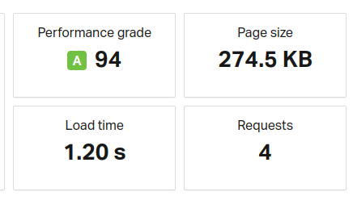

# LLM Catalogue App

The LLM Catalogue App is a frontend web application built with React, TypeScript, Tailwind CSS, Shadcn, Redux, React Router and MockAPI. It provides a user-friendly interface to explore and interact with various Language Models (LLMs).

## Features

- **Explore**: Discover a curated collection of LLMs with detailed descriptions, use cases, and sample interactions.
- **Interact**: Test different LLMs by providing prompts and observing their responses in real-time.
- **Save Favorites**: Save your favorite LLMs for quick access later.
- **Custom LLM Model**: Add your own custom LLM models to the catalogue for personal or community use.

## Technologies Used

- **React**: Frontend development library for building interactive user interfaces.
- **TypeScript**: Typed superset of JavaScript for enhanced code quality and maintainability.
- **Tailwind CSS**: Utility-first CSS framework for styling the app with speed and flexibility.
- **Shadcn**: Shadcn provides beautiful, customizable UI components you can copy-paste into your web apps.
- **Redux**: State management library for managing application state and data flow.
- **React-Router**: Routing library for managing navigation between different views in a React application.
- **React Icons**: Library of SVG icons for easy integration into your React application.
- **Clerk**: Authentication and authorization library for React applications.
- **MockAPI**: Service for simulating a backend API and defining mock responses during development.

## Installation

To run the LLM Catalogue App locally, follow these steps:

1. Clone the repository:

   ```bash
   git clone https://github.com/brf153/atlan_frontend_test.git
   ```

2. Navigate to project directory

    ```bash
    cd atlan_frontend_test
    ```

3. Install dependencies:

    ```bash
    npm install
    ```

4. Make a .env file(look at .env.example for reference) and fill in the details

5. Run the server:

   ```bash
   npm run dev
   ```

## Website Statistics



Source: [Pingdom](https://tools.pingdom.com/)

**To reduce load time, I have considered the following strategies:**
1. Address Largest Contentful Paint (LCP) issues to improve page loading speed.
2. Convert images to WebP format for better compression and faster loading times, particularly for JPEG, PNG, and GIF formats.
3. Refactor JavaScript code to remove unused or redundant code, optimizing performance and reducing file size.

## Website Overview:

1) Except for the Chat page, all pages share the same layout, consisting of a navbar, a sidebar, and child components including the Home page, MyAI page, and Favourites page.
2) The Home page serves as the basic catalogue page, displaying all available LLM models. Currently, only six models are available, presented in both the top and bottom sections of the Home page.
3) To access content on the Chat page, MyAI page, and Favourites page, users must first sign in. Authentication is handled by Clerk.
4) After signing in, users can select an LLM model to interact with on the Home page.
5) Upon selection, users are directed to the Chat page, featuring a model sidebar displaying available LLM models ("Try These" section). Additionally, a model description sidebar provides information about the selected model, including its description, code snippet, and use cases. A temperature meter allows users to adjust the temperature for the LLM models, and an LLM dropdown menu enables selection of the desired model for interaction. The chat section facilitates interaction with the selected LLM model.
6) Currently, six LLM models are integrated, with five for text and one for images. Creative models generate images, while programming or academic models are used for bot interaction.
7) Users can change LLM models by selecting from the dropdown menu and adjust the temperature to alter response randomness.
8) Multiple REST APIs are utilized for LLM models, with some providing consistent responses (OpenAI, Llama, Stability AI) and others yielding more random responses (Goose, Eleuthar AI).
9) Users can mark LLM models as favorites by clicking the star icon. These favorites are accessible on the MyAI page under the "Favourites" section. Note that due to limitations with the PUT endpoint in MockAPI, changes to custom data are only reflected in the Redux store.
10) The MyAI page allows users to create custom AI models by clicking the "Add" button. Currently, only one custom model can be created, which is then displayed on the homepage alongside other models.
11) The homepage categorizes LLM models into programming, creative, academic, and featured sections.
12) For the featured section, weights based on likes, views, and stars are assigned and multiplied by their respective counts. The top three models based on these calculated values are listed in the featured section.
13) Users can sign out by clicking their profile button in the navbar.
14) This overview outlines the key features and functionalities of the website. Custom API endpoints are provided by MockAPI, and Redux is utilized for state management. Routing is handled by React Router.
